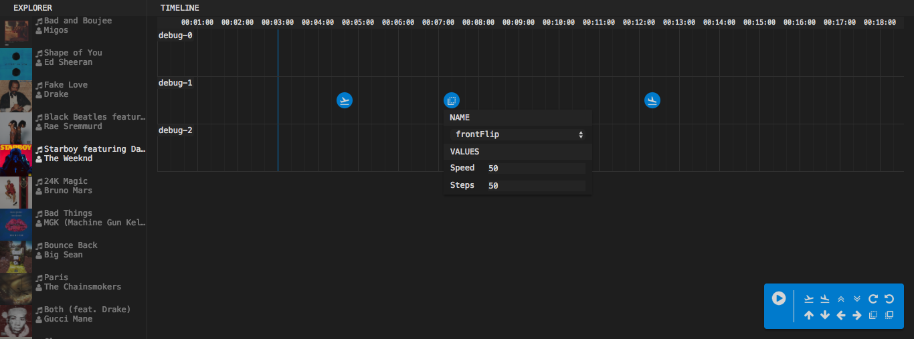

# Melody Flag

ハッカソンのアレ



## Setup

Write keys in `settings/settings.json`

e.g.)

```json
{
	"key": "xxxxxxxxxxxxxxxxxxxxxxxxxxxxxxxx",
	"secret": "xxxxxxxxxxxxxxxxxxxxxxxxxxxxxxxx"
}
```

## Development

```bash
npm run webpack -- -w
# npm run watch
npm run server
open http://localhost:3000
```
